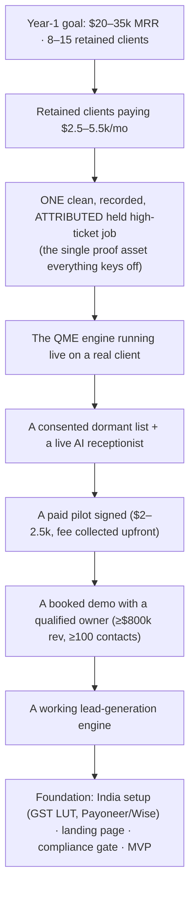

# Problem Statement — worked backwards

**Project:** TechAegisAI "Qualified Meetings" (QME) · **Date:** 2026-06-14
**Source of truth:** [../validation-and-strategy/VALIDATED-STRATEGY.md](../validation-and-strategy/VALIDATED-STRATEGY.md). This document reframes that strategy as a *working-backwards* problem definition — start from the outcome, find the single problem that unlocks it.

---

## 1. The end state we are working back from

By the **end of Year 1**: **$20–35k MRR**, **8–15 retained** home-services clients, **<5%/mo churn**, **one** repeatable delivery workflow, and **one recorded, attributed, held high-ticket job** as the proof asset. (Targets per the 3-year plan; the binding constraint is the proof asset, not the MRR.)

## 2. Working backwards — the dependency chain

Read top-to-bottom as *"to get this, we first need that."* The whole business collapses to **one** load-bearing node at the bottom.

**The reading:** MRR needs retained clients → retention needs proven ROI → proof needs the engine live on a real list → that needs a signed pilot → that needs booked demos → that needs lead-gen → all of it needs the foundation. **Everything reduces to producing one recorded, attributed, held high-ticket job.**

## 3. The problem statement (one paragraph)

> **Owner-operated US home-services contractors (HVAC, roofing, plumbing, electrical) lose tens of thousands of dollars a year to two leaks — missed/after-hours calls that go straight to a competitor, and old customers and unsold estimates they never follow up — yet there is no trustworthy, hands-off fix for a small operator.** The software that fixes it requires them to *operate* a tool they have no time or staff to run; the funded players (Avoca, Netic, ServiceTitan-native) refuse to serve sub-$3M shops by design; and the handful of done-for-you operators show **zero verifiable proof**. The result is a high-ticket revenue leak with no credible, done-for-you solution for the very segment that feels it most.

**The leak, quantified** (home-services phone-stat aggregates): a missed call is worth **$350–1,200**; **85%** of missed calls go to voicemail with no callback; **67%** of callers ring a competitor after one miss; **47%** of calls happen after hours.

## 4. Who has the problem (the buyer)

The **owner of a 3–15-truck shop.** No procurement layer — the owner decides (a spouse co-running the office is often the swing vote on recurring spend). **Phone-first** (68% prefer phone for first contact), **largely absent from LinkedIn**, **identity fused with the business**, **skeptical** (burned by Angi/HomeAdvisor and setup-fee CRMs) **but transactional** — when they believe something pays, they move fast and stay loyal. Reachable **6–7am & 5–7pm local, Tue–Thu**.

## 5. Why the problem persists (why now)

- **The tools demand operation they won't do.** Self-serve AI receptionists ($29–149/mo) hand the owner a console to configure — and they don't.
- **The funded players abandon the segment on purpose.** Revenue floors ($3M–$10M+), ServiceTitan dependence, 20-tech minimums.
- **The done-for-you clones can't earn trust.** Not one has audited financials, a real review profile, or a verifiable named client beyond a single case study — a **category-wide credibility vacuum.**
- **AI voice only just became good and cheap enough** (2024–2026) to do this done-for-you at a margin from India.
- **So the opening is now:** the first operator to publish *independently verifiable, recorded, attributed* ROI for the small operator wins the trust the whole field lacks.

## 6. The job to be done

> *"When I miss a call or I'm sitting on a pile of old customers, turn them into booked, **held**, high-ticket jobs for me — without me running any software or learning anything — and **show me exactly what you made me**."*

## 7. The wedge (the smallest thing that works)

**Reactivate the client's OWN, consented dormant list.** It is simultaneously (a) the **cleanest legal entry** (their own opted-in contacts, not cold), (b) the **fastest visible ROI** (booked jobs in days), and (c) the **#1 proof-generator** (a recorded, attributed, held high-ticket job). The reactivation is the **onboarding win**, not the product — it depletes in days. The proof it produces is what unlocks the durable **managed-receptionist retainer.**

## 8. What must be true (load-bearing assumptions — validated)

| Assumption | Status after validation |
|---|---|
| Reactivation books **3–10%** of a real consented list | ✅ Validated range (founder's 10–25% was too high) |
| A **held** high-ticket job ($8–20k) dwarfs the fee | ✅ True **for HVAC replacement & roofing only** (not plumbing/electrical service) |
| Owner pays **~$1–1.5k/mo to start**, more after proof | ✅ Validated; $2.5–5k is the *post-proof* / up-market price |
| The list has **documented/obtainable consent** | ⚠️ **The hard gate** — thin consent records are the #1 legal risk (you're a co-sender) |
| We can **win the deal despite the offshore trust gap** | 🔶 **The #1 open risk** — mitigate with US LLC/number + founder-led close; instrument close-rate from day 1 |

## 9. The one metric that matters

**One recorded, attributed, HELD high-ticket job.** Until that exists, nothing else (MRR, retainer pricing, scaling) is real. Early north-star: **# of held high-ticket jobs attributable to us.** Everything in the [Getting-Started plan](GETTING-STARTED.md) is sequenced to reach it fastest.

## 10. Anti-goals (solving this does NOT mean)

- ❌ Running their ads / generating net-new leads (different, ad-dependent, competes with their agency).
- ❌ Selling "an AI agent" or projecting revenue/earnings (the FTC banned Air.ai's owners $18M for earnings claims).
- ❌ Med spa / dental yet (HIPAA → Business Associate → BAA).
- ❌ Racing RevSquared to $147 self-serve (a commodity game you'd lose).
- ❌ Building SaaS before the done-for-you service is proven and repeatedly paid for.

---

*Next: [BUSINESS-WORKFLOW.md](BUSINESS-WORKFLOW.md) (how it runs) · [GETTING-STARTED.md](GETTING-STARTED.md) (what to do first).*
